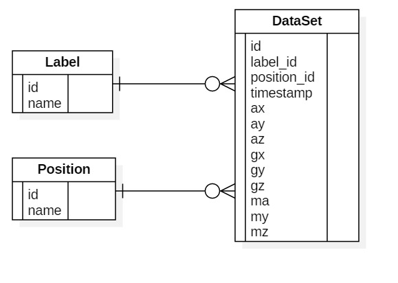

# Design document

## Database Entity Relationship Diagram



## Application Layer Protocol Specification

This experimental protocol is designed to send CSV files between two devices.
This application layer protocol is done on `TCP 9999` port. This protocol
defines three kinds of messages, `SEND`, `OK`, `ERROR`. These messges are
defined later in this document.

### Procedure

A reciver is a server that listens the `TCP 9999` port for a sender. 
The sender rqeust connection to the receiver. Opon established, the sender would
send a `SEND` message to the receiver. Then reciver _MUST_ send either `OK`
or `ERROR` message back to the sender. After receiving reply, the sender can
either send another `SEND` messages or disconnect the TCP port.


### Message types

Each messages consist of header and payload (except `OK` message doesn't have
payload). The legnth of header _should not_ exceed more than 512 bytes.

#### `SEND` Message

```
SEND <length of payload> <label> [body position] \LF
<CSV file payload>
```

#### `OK` Message

```
OK \LF
```

#### `ERROR` Message

```
ERROR <length of payload>\LF
<Error message payload>
```